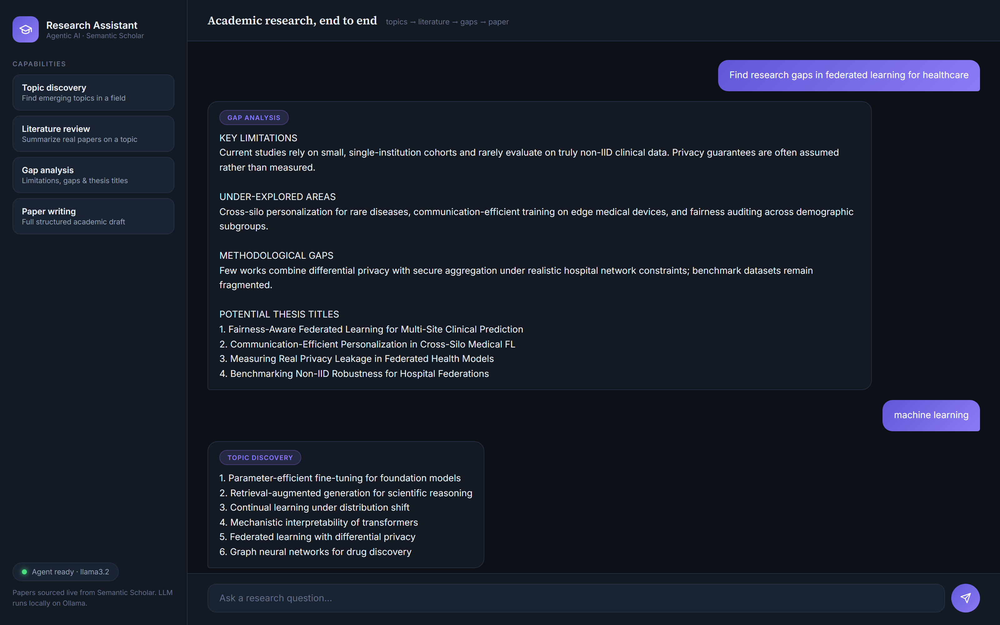

<div align="center">

# AI Research Assistant

**An agentic academic research system — topic discovery, literature reviews over real papers, gap analysis, and full paper drafting, all on a local LLM.**

<br>


<br>



</div>

---

## Overview

Give it a field and it finds emerging research topics. Give it a topic and it pulls **real papers from Semantic Scholar**, writes a literature review, identifies research gaps, proposes thesis titles, and can draft a complete structured paper — reviewed and polished by a second editorial pass. The language model is **Llama 3.2 running locally via Ollama**: no API costs, and your research stays on your machine.

The agent routes each query to the right tool automatically:

| You ask | Tool used |
| :--- | :--- |
| A single field keyword — *"machine learning"* | **Topic discovery** — 12 emerging topics from recent papers |
| *"Literature review on X"* | **Full pipeline** — papers → review → gaps → topic → draft → polish |
| *"Find research gaps in X"* | **Gap analysis** — limitations, gaps, thesis titles, research questions |
| *"Write a paper on X"* | **Paper writer** — complete 11-section academic draft |
| A long pasted draft | **Paper reviewer** — editorial pass for clarity and rigor |
| Anything non-academic | Politely declined — it's a research specialist |

---

## Features

- **Real literature, not hallucinated** — papers fetched live from the Semantic Scholar Graph API (title, abstract, authors, year, URL)
- **Five-stage research pipeline** — literature → gap analysis → topic selection → drafting → editorial review
- **Plain-function tools** — no framework decorators; every tool is a readable, testable Python function
- **Local LLM** — Llama 3.2 via Ollama, lazily initialized; the server runs and reports status honestly even when Ollama is down
- **Scholarly UI** — dark research-console design with capability cards, tool badges on every answer, sectioned paper rendering, and a live agent-status pill

---

## Getting Started

**Prerequisites:** Python 3.10+ and [Ollama](https://ollama.com) with `ollama pull llama3.2`.

```bash
git clone https://github.com/Muhammadwaqas1234/research_assistant.git
cd research_assistant

python -m venv venv
venv\Scripts\activate            # Windows  (source venv/bin/activate on macOS/Linux)
pip install -r requirements.txt

uvicorn main:app --reload
```

Open **http://127.0.0.1:8000**. API docs at `/docs`, readiness probe at `/health`.

---

## API

| Method | Endpoint | Description |
| :--- | :--- | :--- |
| `POST` | `/ask` | `{ "query": "..." }` → routed to the right research tool |
| `GET` | `/health` | Agent readiness + model info |
| `GET` | `/` | Research console UI |

Responses are prefixed with the tool that produced them (e.g. `[research_gap_finder]`), which the UI renders as a badge.

---

## Project Structure

```
├── main.py              # FastAPI app, tools, pipeline orchestrator, routing
├── requirements.txt
├── templates/
│   └── index.html       # Research console
└── static/
    ├── styles.css       # Scholarly dark theme
    └── script.js        # Chat logic, tool badges, paper section rendering
```

---

## Roadmap

- Citation export (BibTeX)
- PDF ingestion for reviewing your own drafts
- Streaming responses for long papers
- Configurable paper structure

---

## Author

**Muhammad Waqas** — [github.com/Muhammadwaqas1234](https://github.com/Muhammadwaqas1234)

<div align="center">

<br>

*Real papers · local LLM · end-to-end research workflow.*

</div>
